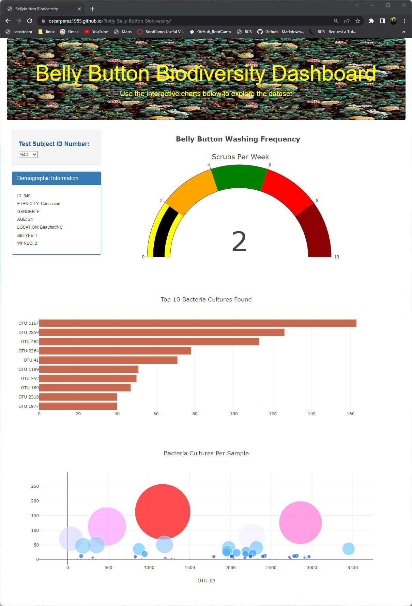
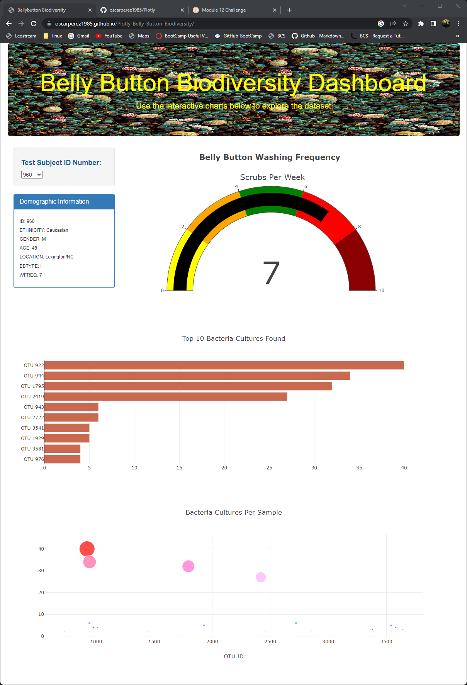

# Plotly Belly Button Biodiversity

## Overview

The objective of this module (**Module 12: Plotly & Belly Button Biodiversity**) is to create a dynamic dashboard in the web using *JavaScript* and *Plotly*, a *JavaScript* data visualization library that offers interactivity with the user.

The input data for this activity is a collection of data samples of different bacteria species found in the human body, more specific in the human belly button.

## Resources

### List of Applications Used

* *HTML5*
* *JavaScript v8*
* *Plotly v2.16*
* *CSS 3*
* *BootStrap v5.2*
* GitHub Pages*

### Input Datasets

* **[Data Samples](./samples.json)**

## Deliverables

The following is the list of the requested and the provided deliverable files for this modules's challenge.

### Requested Deliverables:

**Deliverable 1:** Create a Horizontal Bar Chart
**Deliverable 2:** Create a Bubble Chart
**Deliverable 3:** Create a Gauge Chart
**Deliverable 4:** Customize the Dashboard

### Provided Deliverables:

* [HTML Code](./index.html)
* [JavaScript Code](./charts.js)
* [CSS Code](./style.css)*
* [README File](./README.md)*
* [Deliverable 4 Snapshot](./Resources/Deliverable4.png)

## Results

The interactive dashboard can be accessed by visiting the following *[GitHub Page](https://oscarperez1985.github.io/Plotly_Belly_Button_Biodiversity/)*.

*Image01: Belly Button Biodiversity Interactive Dashboard*

The user interact with the dashboard by selecting any Test Subject ID Number from the drop donwn menu.

When selecting a different Test Subject ID Number, the gauge chartm, the horizontal bar chart and the bubble chart will be updated.

*Image03: Updated Dashboard*